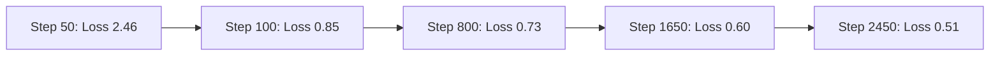

# Technical Report: FinanceQW-COT

**Project Title:** FinanceQW-COT: Fine-Tuning Qwen2.5-0.5B-Instruct for Financial Chain-of-Thought Reasoning  
**Repository:** `RAVER2003/FinanceQW-COT`  
**Date:** August 17, 2026  

---

## 1. Executive Summary

The **FinanceQW-COT** project presents a fine-tuned, lightweight Financial Reasoning Large Language Model (LLM) designed to perform Chain-of-Thought (CoT) reasoning for financial domain tasks. Built upon the foundation of **`Qwen/Qwen2.5-0.5B-Instruct`**, the model was trained on a dataset of **17,726 financial instruction-reasoning pairs**. 

By enforcing sequence length filtering and PyTorch VRAM optimization techniques on a single **NVIDIA Tesla T4 GPU**, the training pipeline completed **3 epochs (2,493 gradient steps)** over **11 hours and 27 minutes**, achieving a training loss reduction from **2.4648** down to **0.5104** (~79.3% reduction).

The fine-tuned model is deployed with an interactive **Gradio GUI interface (`chatbot.py`)** that features real-time streaming token generation, dynamic sliding window history management, and split-screen visualization of explicit `<think>` reasoning steps alongside final financial answers.

---

## 2. Model & Dataset Architecture

### Base Model Selection
- **Base Architecture:** `Qwen/Qwen2.5-0.5B-Instruct`
- **Parameter Count:** ~490 Million (0.5B)
- **Model Size:** ~988 MB (FP16 / Safetensors)
- **Rationale:** High token-efficiency and strong base instruction-following performance relative to its lightweight footprint, making it ideal for low-latency inference on edge/consumer hardware.

### Dataset Profile & Preprocessing
- **Raw Dataset Source:** `train_english_only.jsonl` (Kaggle source)
- **Initial Dataset Size:** 17,726 samples
- **Data Structure:**
  - `instruction`: Task intent (e.g., sentiment classification, quantitative financial calculation, credit report inquiry).
  - `input`: Additional textual context or numeric inputs.
  - `output`: CoT reasoning encapsulated within `<think>...</think>` tags followed by the explicit final answer.

#### Token Length Distribution Statistics
Before training, exact token lengths were computed across all 17,726 dataset samples:

| Metric | Token Length |
| :--- | :--- |
| **Count** | 17,726 |
| **Mean** | 2,087.47 |
| **Std Dev** | 1,838.33 |
| **Min** | 162 |
| **25th Percentile** | 1,115 |
| **50th Percentile (Median)** | 1,735 |
| **75th Percentile** | 2,394 |
| **Max** | 59,864 |

#### Filtering Strategy
To prevent CUDA Out-Of-Memory (OOM) failures on a 16 GB VRAM GPU, sample sequence length was capped at **2,394 tokens** (75th percentile threshold). 

- **Samples Retained:** 13,296 samples (~75% of total dataset)
- **Long Samples Filtered Out:** 4,430 samples (> 2,394 tokens)
- **Filtered Dataset File:** `filtered_dataset.jsonl`

---

## 3. Training & Hardware Configuration

### Hardware & Environment
- **Compute Hardware:** NVIDIA Tesla T4 GPU (16 GB VRAM)
- **Execution Runtime:** Kaggle Notebook (`500-m.ipynb`)
- **Total Training Time:** 11 Hours, 27 Minutes, 13 Seconds (41,233 seconds)

### Hyperparameters & Optimizations

```python
TrainingArguments(
    output_dir="/kaggle/working/qwen-output",
    num_train_epochs=3,
    per_device_train_batch_size=1,
    gradient_accumulation_steps=16,  # Effective Batch Size = 16
    learning_rate=2e-5,
    warmup_ratio=0.03,
    logging_steps=50,
    save_steps=800,
    save_total_limit=2,
    fp16=True,
    optim="adamw_torch",
)
```

### Memory-Safety Patching
To maximize GPU VRAM utilization without exceeding hardware bounds, the following PyTorch/Hugging Face patches were implemented:
1. **PyTorch CUDA Allocator Tuning:** `os.environ["PYTORCH_CUDA_ALLOC_CONF"] = "expandable_segments:True"`
2. **Gradient Checkpointing:** `model.gradient_checkpointing_enable()` enabled to trade minor compute for reduced activation memory footprint.
3. **KV Cache Disabling:** `model.config.use_cache = False` during training.
4. **Garbage Collection:** Periodic `gc.collect()` and `torch.cuda.empty_cache()` calls prior to Trainer initialization.

---

## 4. Training Loss Trajectory & Metrics

The model demonstrated smooth, steady convergence throughout the 2,493 training steps across 3 epochs.

### Key Epoch Checkpoints

- **Step 50:** Loss = 2.4648 (Initial baseline)
- **Step 100:** Loss = 0.8516 (Rapid alignment phase)
- **Step 800 (Epoch 1):** Loss = 0.7310
- **Step 1650 (Epoch 2):** Loss = 0.5992
- **Step 2450 (Epoch 3):** Loss = 0.5104 (Final converged state)



### Complete Training Loss Log

| Step | Training Loss | Step | Training Loss | Step | Training Loss |
| :--- | :--- | :--- | :--- | :--- | :--- |
| **50** | 2.4648 | **900** | 0.6175 | **1750** | 0.5285 |
| **100** | 0.8516 | **950** | 0.6263 | **1800** | 0.5473 |
| **150** | 0.8345 | **1000** | 0.6403 | **1850** | 0.5401 |
| **200** | 0.7921 | **1050** | 0.6207 | **1900** | 0.5244 |
| **250** | 0.7712 | **1100** | 0.6184 | **1950** | 0.5414 |
| **300** | 0.7819 | **1150** | 0.6504 | **2000** | 0.5305 |
| **350** | 0.7700 | **1200** | 0.6359 | **2050** | 0.5140 |
| **400** | 0.7647 | **1250** | 0.6242 | **2100** | 0.5290 |
| **450** | 0.7520 | **1300** | 0.6026 | **2150** | 0.5191 |
| **500** | 0.7667 | **1350** | 0.6320 | **2200** | 0.5350 |
| **550** | 0.7445 | **1400** | 0.6190 | **2250** | 0.5288 |
| **600** | 0.7307 | **1450** | 0.6080 | **2300** | 0.5181 |
| **650** | 0.7085 | **1500** | 0.5991 | **2350** | 0.5239 |
| **700** | 0.7126 | **1600** | 0.6044 | **2400** | 0.5191 |
| **750** | 0.7476 | **1650** | 0.5992 | **2450** | 0.5104 |
| **800** | 0.7310 | **1700** | 0.5429 | **2493 (Final)** | ~0.5100 |

---

## 5. Deployment & Chatbot UI Integration

The trained model artifacts (`qwen-final-model`) are integrated into an interactive web application built with **Gradio (`chatbot.py`)**.

### Application Features & Architecture

1. **Model Loading:** Loads model weights in `float16` precision onto CUDA/CPU for low memory latency.
2. **Real-time Token Streaming:** Utilizes Hugging Face `TextIteratorStreamer` executed on a separate thread to deliver low-latency real-time response generation.
3. **Chain-of-Thought (CoT) Parsing:**
   - Custom `split_think_answer()` utility extracts reasoning contained within `<think>` tags.
   - Updates two distinct UI containers simultaneously: **Model Thinking** (CoT process) and **Final Answer**.
4. **Session Management:**
   - Automatic naming of chat sessions based on sanitized user queries.
   - Persistence of chat sessions stored as JSON objects in `chat_sessions/`.
   - Dropdown selection to inspect and reload past conversation threads.
5. **Sliding Context Window:** Implements a sliding window over the last 4 dialogue turns (`context_length = 4`) to prevent prompt ballooning while maintaining conversation coherence.

### Inference Hyperparameters
- `max_new_tokens`: 800
- `temperature`: 0.4
- `top_p`: 0.9
- `do_sample`: True

---

## 6. Project Directory Structure

```
RAVER2003/FinanceQW-COT/
├── 500-m.ipynb            # Fine-tuning notebook (Kaggle execution, data filtering, training logs)
├── chatbot.py             # Gradio web UI application with streaming CoT display
└── chat_sessions/         # Directory storing saved chat JSON session logs (created at runtime)
```

---

## 7. Key Takeaways & Recommendations

> [!TIP]
> **Key Takeaway:** Filtering data at the 75th percentile token threshold allowed training an FP16 model on a single 16 GB T4 GPU without memory errors while preserving 13,296 high-quality financial instruction samples.

> [!NOTE]
> **Next Steps / Potential Enhancements:**
> - **Evaluation Metrics:** Incorporate automated evaluation benchmarks (e.g., ROUGE, BLEU, or Financial QA accuracy on benchmark test sets) to measure post-tuning accuracy.
> - **LoRA/QLoRA Fine-Tuning:** Explore parameter-efficient fine-tuning (PEFT) using LoRA to allow larger base models (e.g., Qwen2.5-7B or 14B) to be trained on the same hardware constraints.
> - **Quantization for Edge Deployment:** Export `qwen-final-model` to GGUF format (e.g., Q4_K_M or Q8_0) for execution on CPU-only edge devices or via Ollama.
